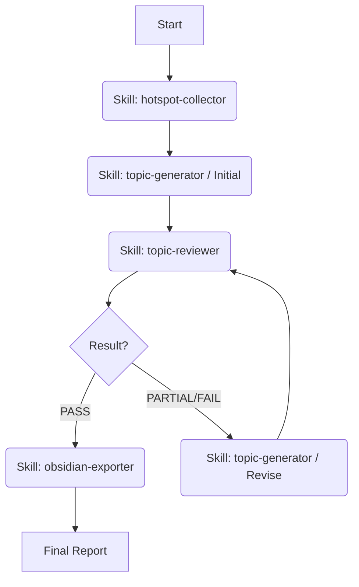

# AI 选题生成系统 (Autonomous Topic Agent)

## 1. 系统架构
本系统是一个符合 "Agent + Skills" 范式的自动化工作流，旨在模拟专业编辑团队的协作流程。
- **Hotspot Collector**: 负责原材料采购（采集）。
- **Topic Generator**: 负责初加工与精加工（生成与修改）。
- **Topic Reviewer**: 负责质检与反馈（审核）。
- **Obsidian Exporter**: 负责最终产品的入库（导出）。
- **Main Agent**: 负责流程调度与迭代控制（总编）。

## 2. 核心工作流 (The Loop)

## 3. 详细执行 SOP (Agent Instructions)

### 阶段一：采集与初稿 (Initialization)
1. **调用 `hotspot-collector`**:
   - 指令: "采集今日全网热点，重点关注 AI 与 Tech 领域。"
   - 检查: 确认 `output/daily_hotspots` 目录下生成了今日的 JSON 文件。
2. **调用 `topic-generator`**:
   - 指令: "基于采集到的热点，生成 TOP 10 选题初稿。"
   - 检查: 确认 `output/generated_topics` 目录下生成了今日的 JSON 文件。

### 阶段二：审核与迭代 (The Feedback Loop)
**这是本系统的核心。Agent 必须自主执行此循环，无需用户干预。**

1. **调用 `topic-reviewer`**:
   - 指令: "严格审核今日选题，给出具体修改指令。"
   - 输出: `output/review_reports` 下的 JSON报告。
2. **读取审核报告**:
   - 检查 `overall_result` 字段。
   - **Case A: PASS** -> 进入阶段三（导出）。
   - **Case B: PARTIAL / FAIL** -> 进入迭代步骤。

### 迭代步骤 (Auto-Revision)
如果审核未通过（PARTIAL/FAIL）：
1. **读取反馈**: 从报告中提取 `revision_instructions`（修改指令）。
2. **调用 `topic-generator`**:
   - 指令: "根据审核报告中的指令，仅修改未通过的选题。保持已通过选题不变。"
   - 上下文: 必须将 `review_reports` 的内容作为 Context 传递给 Skill。
3. **回环**: 修改完成后，**立即再次调用 `topic-reviewer`** 进行复核。
   - *限制*: 设置最大迭代次数为 3 次。如果 3 次后仍未全过，输出当前最佳结果并继续。

### 阶段三：导出与交付 (Export & Delivery)
1. **调用 `obsidian-exporter`**:
   - 指令: "将审核通过的选题导出到 Obsidian 知识库。"
   - 目标路径: `D:\Documents\Obsidian Vault` (用户配置路径)。
   - 检查: 确认文件已写入 `[Vault]/00_Inbox/选题池/YYYY-MM-DD_每日选题.md`。
2. **最终汇报**:
   - 向用户展示本次任务的统计数据（热点数、通过率、导出路径）。

## 4. 用户交互脚本

**用户**: "开始今日选题"
**Agent**:
"收到。正在启动全自动选题流程：
1. 正在采集全网热点... (调用 Collector)
2. 正在生成初稿... (调用 Generator)
3. 正在进行第一轮审核... (调用 Reviewer)
... (若需要修改) 检测到部分选题未达标，正在自动优化...
... (复核) 优化完成，再次审核...
4. 正在导出到 Obsidian... (调用 Exporter)
🎉 任务完成！已生成今日选题日报：
📂 路径: `D:\Documents\Obsidian Vault\00_Inbox\选题池\2026-01-29_每日选题.md`"

## 5. 文件与路径规范
- Skills: `skills/hotspot-collector`, `skills/topic-generator`, `skills/topic-reviewer`, `skills/obsidian-exporter`
- Output: `output/daily_hotspots`, `output/generated_topics`, `output/review_reports`
