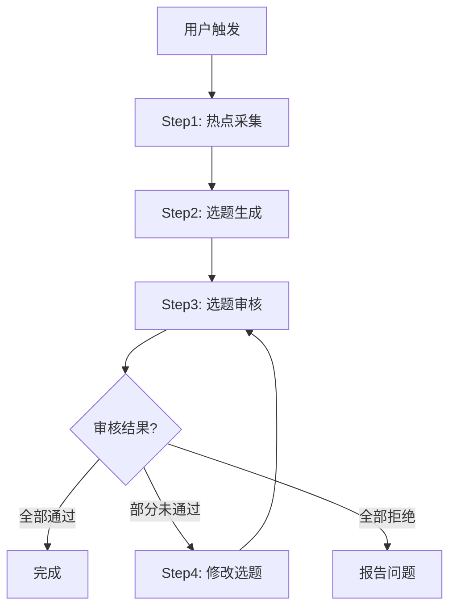

# AI 选题生成系统

> 一个全自动的内容选题生成系统，通过 1 个主 Agent + 3 个专业 Skills 实现从热点采集到选题审核的完整工作流。

## 📋 项目简介

这个系统可以帮助内容创作者自动化完成选题流程，原本需要 2-3 小时的工作，现在只需一句话即可完成：

**"开始今日选题生成"**

系统会自动：
1. 从多个平台采集最新热点（Twitter、Reddit、Github、微博、知乎等）
2. 分析并生成 TOP10 高质量选题（包含事件描述、核心角度、标题）
3. 智能审核选题质量，给出修改意见
4. 自动迭代优化，直到所有选题通过审核

## 🎯 核心特性

- **全自动化**：一键触发完整流程，无需人工干预
- **智能迭代**：审核不通过自动修改，持续优化直到达标
- **多平台支持**：覆盖中英文主流内容平台
- **质量保证**：严格的审核标准确保选题价值
- **结构化输出**：JSON 格式，便于后续处理

## 🏗️ 系统架构

```
                    AGENTS.md 总控中枢
                            │
        ┌───────────────────┼───────────────────┐
        ↓                   ↓                   ↓
  Skill1: 热点采集员   Skill2: 选题生成师   Skill3: 选题审核官
  采集社交媒体数据    AI生成选题内容       智能审核与评估
        ↓                   ↓                   ↓
  daily_hotspots/    generated_topics/    review_reports/
```

### 组件说明

| 组件 | 功能 | 输出 |
|------|------|------|
| **主 Agent** | 协调调度，流程控制 | - |
| **Skill1: 热点采集员** | 多平台热点数据采集 | `daily_hotspots/*.json` |
| **Skill2: 选题生成师** | 基于热点生成选题方案 | `generated_topics/*.json` |
| **Skill3: 选题审核官** | 质量审核与反馈 | `review_reports/*.json` |

## 🚀 快速开始

### 前置要求

- Claude Code 已安装并配置
- 已安装本项目的 3 个 Skills

### 安装 Skills

1. **将 skills 目录复制到 Claude Code 的 skills 路径**

2. **或者手动安装每个 skill**：
   - 热点采集员：`skills/hotspot-collector/`
   - 选题生成师：`skills/topic-generator/`
   - 选题审核官：`skills/topic-reviewer/`

### 基础使用

```bash
# 启动 Claude Code
claude

# 在对话中输入
开始今日选题生成
```

系统会自动执行完整流程并输出结果。

## 📊 工作流程详解

### 标准流程



### 迭代优化机制

当审核发现问题时：
1. 审核官给出详细的修改意见
2. 主 Agent 读取反馈并传递给选题生成师
3. 选题生成师针对性修改未通过的选题
4. 重新提交审核
5. 重复直到全部通过（最多3轮）

## 📁 文件结构

```
ai-topic-generator/
├── README.md                    # 本文件
├── AGENTS.md                    # 主 Agent 配置与说明
├── skills/                      # Skills 目录
│   ├── hotspot-collector/       # Skill1: 热点采集员
│   │   └── SKILL.md
│   ├── topic-generator/         # Skill2: 选题生成师
│   │   └── SKILL.md
│   └── topic-reviewer/          # Skill3: 选题审核官
│       └── SKILL.md
└── output/                      # 输出目录
    ├── daily_hotspots/          # 热点数据存储
    │   └── YYYY-MM-DD.json
    ├── generated_topics/        # 生成的选题
    │   └── YYYY-MM-DD.json
    └── review_reports/          # 审核报告
        └── YYYY-MM-DD.json
```

## 📝 输出示例

### 热点数据 (daily_hotspots/)

```json
[
  {
    "id": "hotspot_001",
    "title": "OpenAI 发布 GPT-4.5",
    "platform": "Twitter",
    "url": "https://...",
    "heat_score": 95,
    "category": "AI",
    "summary": "OpenAI 发布最新模型 GPT-4.5...",
    "keywords": ["GPT-4.5", "OpenAI", "大模型"],
    "collected_at": "2026-01-13T10:30:00Z"
  }
]
```

### 选题方案 (generated_topics/)

```json
{
  "topic_id": "topic_001",
  "rank": 1,
  "event_description": {
    "title": "GPT-4.5 发布：三大升级重塑 AI 应用格局",
    "what": "OpenAI 发布 GPT-4.5，在推理能力、多模态处理、成本效率三方面实现重大突破...",
    "background": "自 GPT-4 发布以来..."
  },
  "core_angle": {
    "angle_title": "从技术升级看 AI 应用开发范式转变",
    "perspective": "聚焦三大升级对开发者的实际影响",
    "unique_value": "不同于主流媒体的技术解读，重点分析对实际应用的影响"
  },
  "headline": {
    "primary": "GPT-4.5 的 3 个关键升级，如何改变你的 AI 应用开发？",
    "alternatives": ["..."],
    "style": "实用分析型"
  }
}
```

### 审核报告 (review_reports/)

```json
{
  "overall_result": "PARTIAL",
  "summary": {
    "total_topics": 10,
    "passed": 7,
    "need_revision": 3,
    "pass_rate": "70%"
  },
  "topic_reviews": [
    {
      "topic_id": "topic_001",
      "result": "PASS",
      "scores": {
        "value": 9.0,
        "uniqueness": 8.5,
        "headline": 9.0,
        "total": 86.5
      }
    }
  ]
}
```

## 🎨 使用场景

### 场景 1：每日选题例行任务

```
用户：开始今日选题生成
系统：[自动执行完整流程，输出 TOP10 选题]
```

### 场景 2：仅采集热点，稍后生成

```
用户：只采集热点，不生成选题
系统：[仅执行热点采集]

# 稍后
用户：基于今天的热点生成选题
系统：[使用已采集的数据生成选题]
```

### 场景 3：针对特定领域

```
用户：采集AI和科技领域的热点，生成相关选题
系统：[调整采集和筛选策略]
```

## ⚙️ 配置与自定义

### 调整采集平台

编辑 `skills/hotspot-collector/SKILL.md` 中的平台列表：

```markdown
### 平台优先级
1. 高优先级：Twitter、Reddit、Github、buzzing
2. 中优先级：知乎、微博、Product Hunt
3. 低优先级：小红书、B站
```

### 调整审核标准

编辑 `skills/topic-reviewer/SKILL.md` 中的评分权重：

```markdown
### 审核维度
- 选题价值 (权重: 30%)
- 角度独特性 (权重: 25%)
- 标题质量 (权重: 20%)
- 可执行性 (权重: 15%)
- 受众匹配度 (权重: 10%)
```

### 设置环境变量

```bash
# 最大迭代次数（默认3）
MAX_ITERATIONS=3

# 最低通过率要求（默认100%）
MIN_PASS_RATE=100

# 是否自动批准达标选题（默认false）
AUTO_APPROVE=false
```

## 🔧 高级功能

### 1. 增量采集

支持基于之前的热点数据进行增量采集，避免重复：

```
用户：基于昨天的热点数据，增量采集今天的新热点
```

### 2. 自定义选题数量

```
用户：生成 TOP5 选题（而不是默认的 TOP10）
```

### 3. 跳过审核环节

用于快速原型验证：

```
用户：生成选题但跳过审核
```

### 4. 手动介入修改

```
用户：显示选题3的详细信息
系统：[展示选题3]
用户：修改选题3的标题为"..."
系统：[更新并重新审核]
```

## 📈 效率对比

| 工作环节 | 传统方式 | 使用本系统 | 提升 |
|---------|---------|-----------|------|
| 热点采集 | 60-90分钟 | 2-3分钟 | **30x** |
| 选题筛选 | 30-60分钟 | 1-2分钟 | **30x** |
| 角度挖掘 | 20-30分钟 | 自动完成 | **∞** |
| 标题创作 | 10-20分钟 | 自动完成 | **∞** |
| 质量审核 | 10-15分钟 | 1分钟 | **10x** |
| **总计** | **2-3.5小时** | **5-10分钟** | **20-40x** |

## 🛠️ 故障排查

### 问题：热点采集失败

**可能原因**：
- 网络连接问题
- API 访问限制
- 平台反爬机制

**解决方案**：
1. 检查网络连接
2. 增加请求间隔
3. 使用备用数据源

### 问题：审核一直不通过

**可能原因**：
- 热点质量不高
- 审核标准过严
- 角度挖掘不够深入

**解决方案**：
1. 调整采集源，关注更优质平台
2. 适当放宽审核标准
3. 在选题生成师中加强角度分析提示

### 问题：迭代次数超限

**可能原因**：
- 选题与审核标准不匹配
- 反馈意见不够明确

**解决方案**：
1. 人工介入，手动调整部分选题
2. 优化审核反馈的清晰度
3. 调整 `MAX_ITERATIONS` 参数

## 🤝 贡献与反馈

如果您有改进建议或发现问题：

1. 优化 Skills 的提示词
2. 调整审核标准和权重
3. 增加新的数据源
4. 改进输出格式

## 📄 许可证

本项目基于文章案例构建，供学习和参考使用。

## 🙏 致谢

- 灵感来源于实际的 AI 选题系统案例
- 基于 Claude Skills 和 Agent 架构
- 感谢 Anthropic 提供的 Skills 框架

---

**开始使用**：复制整个 `ai-topic-generator` 目录，在 Claude Code 中说"开始今日选题生成"即可！
